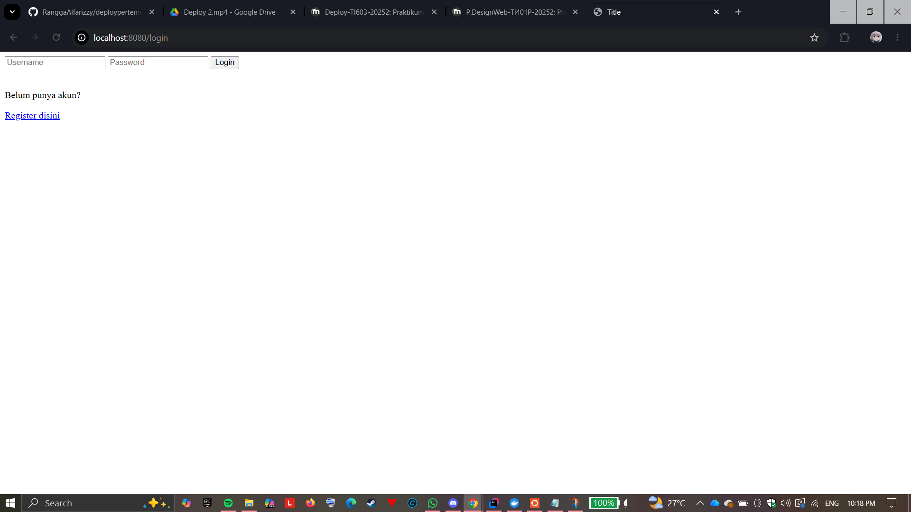
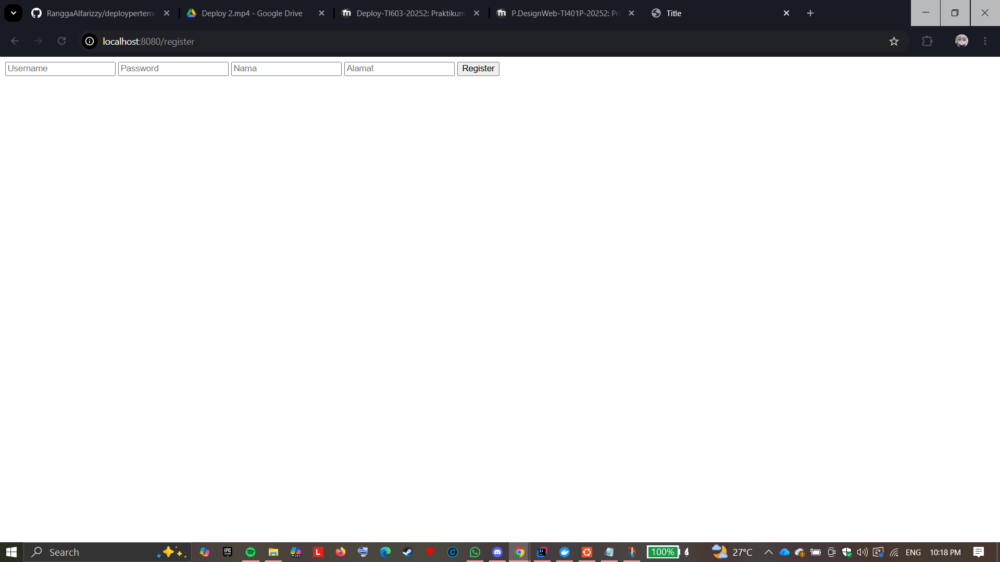
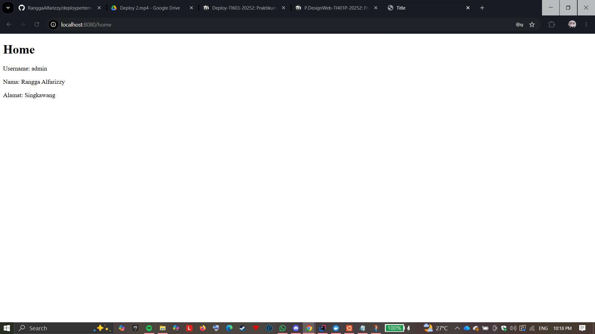
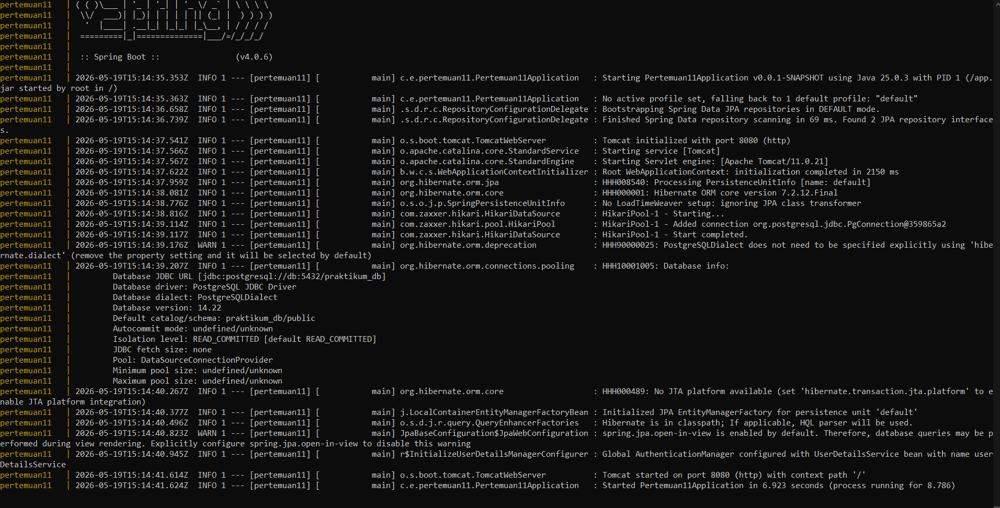
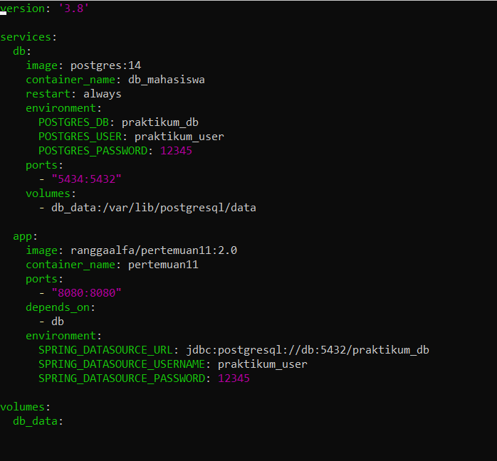
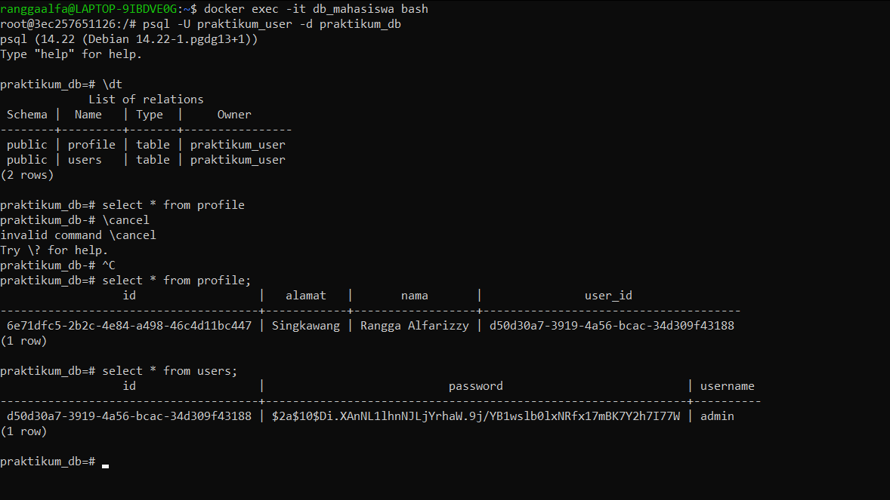

# 🚀 Praktikum Pertemuan 11

---

## 👨‍💻 Identitas Mahasiswa
Nama : Rangga Alfarizzy
NIM : 20240140059
---

# 📖 Deskripsi

Project ini merupakan aplikasi sederhana berbasis **Spring Boot** yang dibuat pada Praktikum Pertemuan 11.  
Aplikasi memiliki fitur autentikasi seperti login dan register, menggunakan database MySQL serta dijalankan menggunakan Docker dan WSL.

---

# ✨ Fitur

- 🔐 Login
- 📝 Register
- 🏠 Home Page
- 🗄️ Integrasi Database MySQL
- 🐳 Docker Support
- 💻 Running di WSL

---

# 🛠️ Teknologi Yang Digunakan

| Teknologi | Keterangan |
|---|---|
| Java | Bahasa Pemrograman |
| Spring Boot | Backend Framework |
| MySQL | Database |
| Docker | Container |
| Docker Compose | Multi Container |
| WSL Ubuntu | Environment Linux |

---

# 📸 Halaman Login

---

# 📸 Halaman Register

---

# 📸 Halaman Home

---

# 💻 Running Application di WSL

---

# ⚙️ Isi docker-compose.yml

---

# 🗄️ Isi Data Pada Tabel Database

---

# ⭐ Penutup

Terima kasih telah mengunjungi repository ini 🙌  
